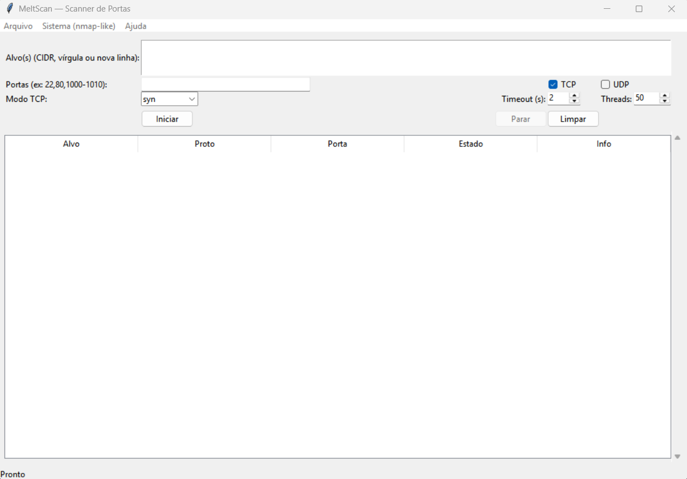
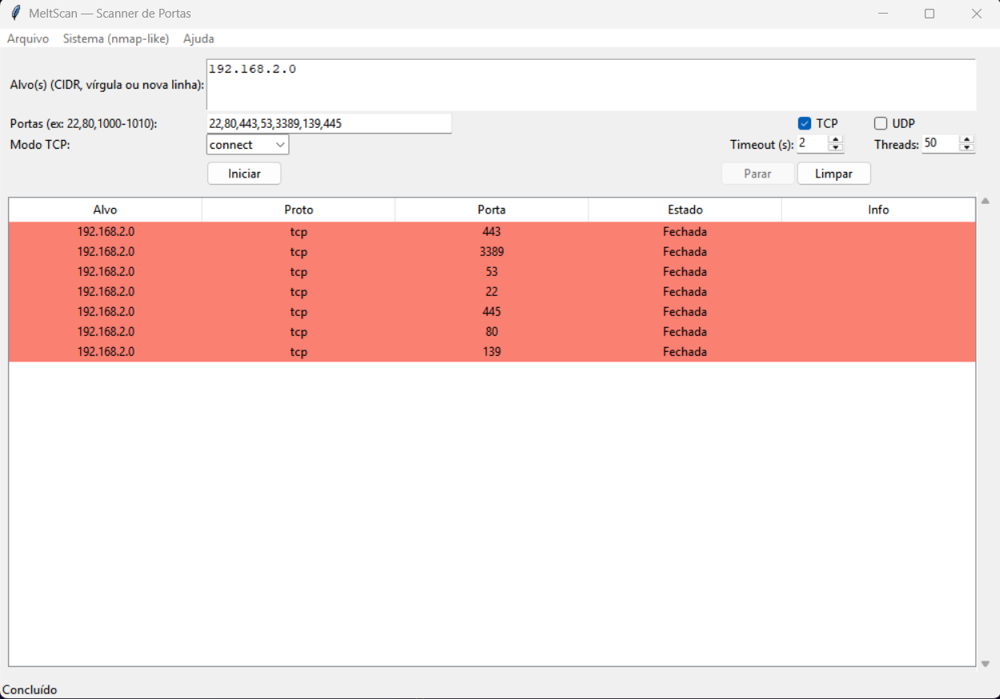
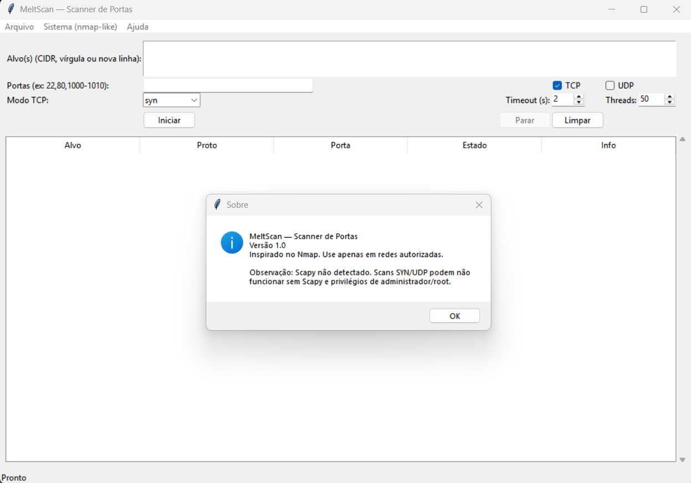

# MeltScan 🔎

MeltScan é um scanner de portas em Python, inspirado no **Nmap**, com interface gráfica em **Tkinter**.  
Ele permite realizar varreduras TCP e UDP em alvos específicos ou em redes inteiras (CIDR), exibindo portas **abertas, fechadas ou filtradas**.  

---

## ✨ Funcionalidades

- Varredura **TCP connect()** e **TCP SYN** (quando [Scapy](https://scapy.net) está disponível).  
- Varredura **UDP** (quando Scapy está disponível).  
- Suporte a múltiplos alvos: IPs, ranges (`22,80,1000-1010`) e CIDR (`192.168.0.0/24`).  
- Interface gráfica multiplataforma (**Linux** e **Windows**).  
- Exportação dos resultados em **TXT** e **CSV**.  
- Presets de varredura estilo **Nmap**: Quick Scan, Ping Scan e Intense Scan.  
- Resultados coloridos: 🟩 Aberta | 🟥 Fechada | 🟨 Filtrada.  

---

## ⚙️ Como funciona

O MeltScan utiliza três abordagens principais para detecção de portas:  

1. **TCP connect()** → método nativo do Python usando `socket`, que tenta estabelecer conexão completa.  
   - ✅ Funciona em qualquer ambiente (Linux/Windows).  
   - ❌ Mais “barulhento” (detectável por firewalls/IDS).  

2. **TCP SYN Scan** → envia pacotes SYN (requisição de conexão) e analisa respostas com **Scapy**.  
   - ✅ Mais rápido e furtivo.  
   - ⚠️ Requer privilégios de administrador/root.  

3. **UDP Scan** → envia pacotes UDP e aguarda resposta.  
   - ✅ Detecta serviços UDP ativos.  
   - ⚠️ Requer privilégios de administrador/root e pode ser mais lento.  

Além disso:  
- A interface gráfica em Tkinter organiza os resultados em tabela.  
- Cada linha mostra **alvo, protocolo, porta, estado e informações adicionais**.  
- O usuário pode exportar os resultados em **TXT** ou **CSV**.  

---

## ⚡ Instalação e Uso

### Requisitos

- Python **3.8+**  
- Bibliotecas necessárias:  

```bash
pip install scapy
```

---

## Clonando o projeto e executando

```bash
git clone https://github.com/seuusuario/meltscan.git
cd meltscan
python meltscan.py
```

---

<<<<<<< HEAD
### 🚀 Execução Rápida
=======
## Executando no Linux

Para varreduras SYN e UDP, é necessário rodar como root:

```bash
sudo python meltscan.py
```

---
>>>>>>> 22a7004efd8707f432bb59383bc00443f343f5d8

## Executando no Windows

```bash
python meltscan.py
```

<<<<<<< HEAD
## Executando no Linux

Para varreduras SYN e UDP, é necessário rodar como root:

```bash
sudo python3 meltscan_gui.py
```

---

## Versão CLI (Linha de Comando):

```bash
# Exemplos de uso:
python meltscan_cli.py 192.168.1.1 -p 80 -t
python meltscan_cli.py 192.168.1.1 -p "22,80,443" -t -u
python meltscan_cli.py 192.168.1.0/24 -p 1-100 -t -o resultados.txt
```

---

## 📁 Estrutura do Projeto

```
MeltScan/
├── meltscan_gui.py          # Versão com interface gráfica
├── meltscan_cli.py          # Versão linha de comando
└── README.md                # Este arquivo
```

---

## 📝 Execute o MeltScan:

1. **Execute o MeltScan:**

```bash
python meltscan_gui.py
```

2. **No campo "Alvo(s)" digite:**

```bash
127.0.0.1
# Ou múltiplos alvos: 192.168.1.1,192.168.1.2
# Ou rede CIDR: 192.168.1.0/24
```

3. **No campo "Portas" digite:**

```bash
22,80,443
# Ou intervalo: 1000-1010
```

4. **Selecione TCP ou UDP e ajuste as opções:**
- Modo TCP: connect ou SYN
- Timeout (segundos)
- Número de threads
5. **Clique em "Iniciar" para começar a varredura.**
6. **Visualize os resultados na tabela com cores indicativas.**
7. **Exporte os resultados usando o menu Arquivo → Exportar TXT/CSV.**

=======
>>>>>>> 22a7004efd8707f432bb59383bc00443f343f5d8
---

## 📂 Exportação de Resultados

- TXT → cada linha contém alvo, protocolo, porta, estado e informações adicionais.
- CSV → compatível com Excel, LibreOffice e Google Sheets.

---

<<<<<<< HEAD
## 🎪 Presets Estilo Nmap

O menu "Sistema" oferece três presets:

1. **Quick Scan → Portas comuns (22,80,443,53,3389,139,445).**
2. **Ping Scan → Apenas verificação de host (sem portas).**
3. **Intense Scan → Portas 1-1024 com scan SYN.**

---

## 📦 Compilação em Executável

=======
## 📦 Compilação em Executável

Se quiser gerar um executável independente:

---
>>>>>>> 22a7004efd8707f432bb59383bc00443f343f5d8

# Windows (.exe)

```bash
pip install pyinstaller
<<<<<<< HEAD
pyinstaller --onefile --windowed meltscan_gui.py
# Executável em: dist/meltscan_gui.exe
```

=======
pyinstaller --onefile meltscan.py
```

O executável será gerado em:

```bash
dist/meltscan.exe
```

---

>>>>>>> 22a7004efd8707f432bb59383bc00443f343f5d8
# Linux (binário ELF)

```bash
pip install pyinstaller
<<<<<<< HEAD
pyinstaller --onefile meltscan_gui.py
# Executável em: dist/meltscan_gui
```

⚠️ Importante: Scans SYN/UDP ainda requerem privilégios administrativos, mesmo no executável.

---

## ⚠️ Solução de Problemas

Erro "ModuleNotFoundError: No module named 'scapy'":
```bash
pip install scapy
```

Erro "tkinter not found" (Linux):
```bash
sudo apt install python3-tk
```
Scans SYN/UDP não funcionam:
Execute com privilégios administrativos: sudo (Linux) ou como Administrador (Windows)
=======
pyinstaller --onefile meltscan.py
```

O executável será gerado em:

```bash
dist/meltscan
```

⚠️ Importante: o .exe só roda no Windows. No Linux, você precisa gerar o binário próprio.
>>>>>>> 22a7004efd8707f432bb59383bc00443f343f5d8

---

## ⚠️ Aviso Legal

Este software deve ser utilizado apenas em redes e sistemas para os quais você tenha autorização explícita.
O uso indevido pode ser considerado atividade ilegal.
Os autores não se responsabilizam por danos ou uso indevido desta ferramenta.

---

## 🙋‍♀️ Autoria

Desenvolvido por: **Lhuany Motta** [🔗 GitHub](https://github.com/LhuanyMotta)
Versão: 1.0

---

<<<<<<< HEAD
## 📝 Exemplo Prático

```bash
# Scan rápido em localhost
python meltscan_gui.py
```

```bash
# Na interface:
- Alvo: 127.0.0.1
- Portas: 22,80,443,3389
- Protocolo: TCP
- Modo: connect
- Clique em "Iniciar"
```

## 📷 Imagens da Aplicação

> 💡 *Demonstrativo do MeltScan*




=======
## 📝 Exemplo Prático de Uso

Escaneando o localhost nas portas 22 e 80:
1. **Execute o MeltScan:**

```bash
python meltscan.py
```

2. **No campo Alvo(s) digite:**

```bash
127.0.0.1 (Exemplo)
```

3. **No campo Portas digite:**

```bash
22,80 (Exemplo)
```

4. **Selecione TCP ou UDP e clique em Iniciar.**

5. **Visualize os resultados e exporte em TXT ou CSV após a conclusão.**
>>>>>>> 22a7004efd8707f432bb59383bc00443f343f5d8

---

## 📜 Licença

<<<<<<< HEAD
Este projeto está licenciado sob a licença MIT.
=======
Este projeto está licenciado sob a licença MIT.
>>>>>>> 22a7004efd8707f432bb59383bc00443f343f5d8
